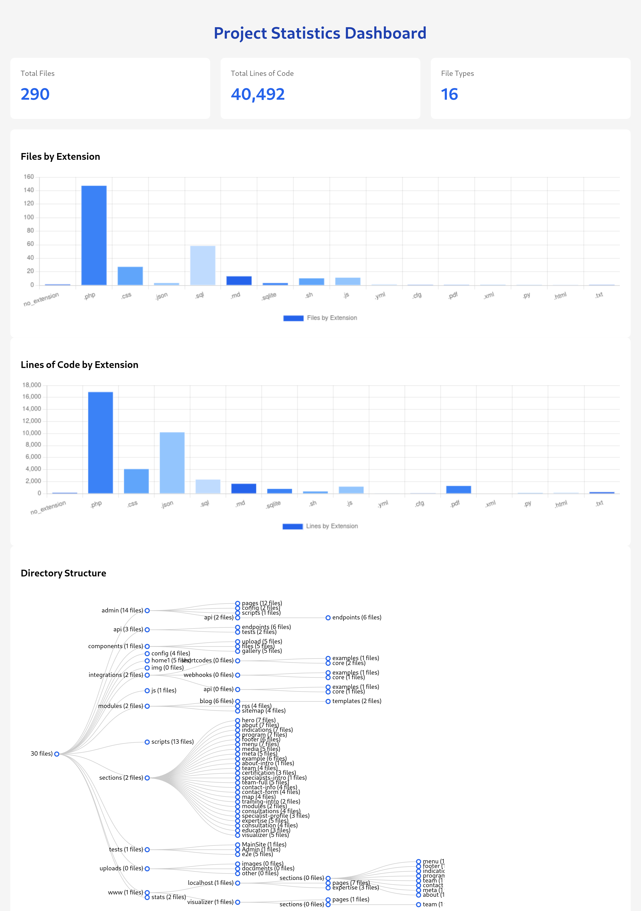

# Modware

A PHP-based CMS with modular architecture and API support.



## Project Structure

```
/app/php/
├── admin/                      # Admin panel files
│   ├── auth.php               # Authentication handler
│   ├── login.php              # Login page
│   ├── logout.php             # Logout handler
│   └── pages/                 # Admin panel pages
│       ├── dashboard.php      # Main dashboard
│       ├── content.php        # Content management
│       ├── menu.php          # Menu management
│       ├── seo.php           # SEO settings
│       └── media.php         # Media management
├── api/                       # API endpoints
│   ├── endpoints/            # API endpoint handlers
│   │   ├── auth.php         # Authentication endpoint
│   │   ├── menu.php         # Menu management endpoint
│   │   ├── pages.php        # Pages management endpoint
│   │   ├── sections.php     # Sections management endpoint
│   │   └── seo.php          # SEO management endpoint
│   └── tests/               # API tests
├── components/               # Reusable components
│   ├── files/               # File management component
│   ├── gallery/            # Gallery component
│   └── upload/             # Upload component
├── config/                  # Configuration files
│   ├── Database.php        # Database configuration
│   └── env.php            # Environment configuration
├── data/                   # Data storage
├── integrations/           # Third-party integrations
│   ├── api/               # API integrations
│   ├── shortcodes/        # Shortcode processors
│   └── webhooks/          # Webhook handlers
├── modules/                # CMS modules
│   ├── blog/              # Blog module
│   ├── rss/              # RSS feed module
│   └── sitemap/          # Sitemap module
├── scripts/               # Utility scripts
│   └── create_user.php   # User management script
├── sections/              # Page sections
│   ├── about/            # About section
│   ├── blog/             # Blog section
│   ├── footer/           # Footer section
│   ├── hero/             # Hero section
│   ├── indications/      # Indications section
│   ├── menu/             # Menu section
│   ├── meta/             # Meta section
│   └── program/          # Program section
├── tests/                # Test files
│   ├── Admin/           # Admin panel tests
│   └── MainSite/        # Main site tests
├── uploads/             # File uploads
│   ├── documents/       # Document uploads
│   ├── images/         # Image uploads
│   └── other/          # Other file uploads
├── .env                # Environment variables
├── .env.example        # Example environment file
├── composer.json       # Composer dependencies
├── index.php          # Main entry point
├── install.php        # Installation script
├── phpunit.xml       # PHPUnit configuration
├── schema.sql        # Database schema
└── test.sh           # Test runner script
```

## Features

- Modular architecture
- API support with JWT authentication
- Admin panel with content management
- File and media management
- SEO optimization tools
- Extensible through modules and integrations
- Component-based development
- Comprehensive testing suite

## Installation

1. Clone the repository
2. Copy `.env.example` to `.env` and configure settings
3. Run `composer install`
4. Run `php install.php` to set up the database
5. Create an admin user with `php scripts/create_user.php`

## Testing

Run the test suite:

```bash
./test.sh
```

This will:
- Set up a test environment
- Create necessary directories
- Initialize the database
- Run API tests
- Run Admin Panel tests

## Development

The project follows a modular architecture where:
- `/sections` contains page sections
- `/components` contains reusable UI components
- `/modules` contains feature modules
- `/integrations` contains third-party integrations

Each module and section follows a consistent structure with:
- `html.php` - Template file
- `query.php` - Database queries
- `style.css` - Styles
- `script.js` - JavaScript
- `admin.php` - Admin interface
- `schema.sql` - Database schema
